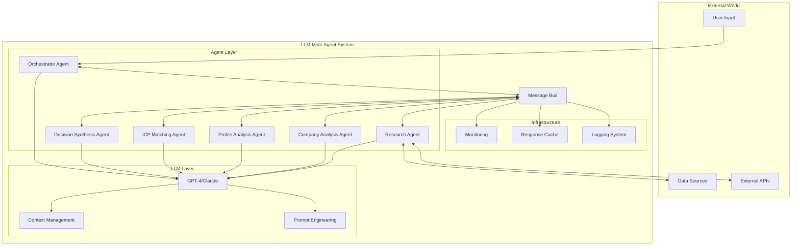
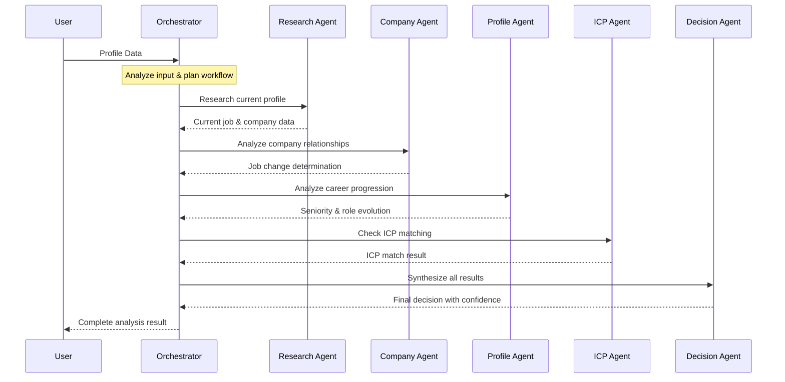
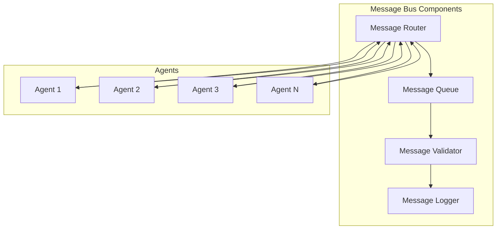
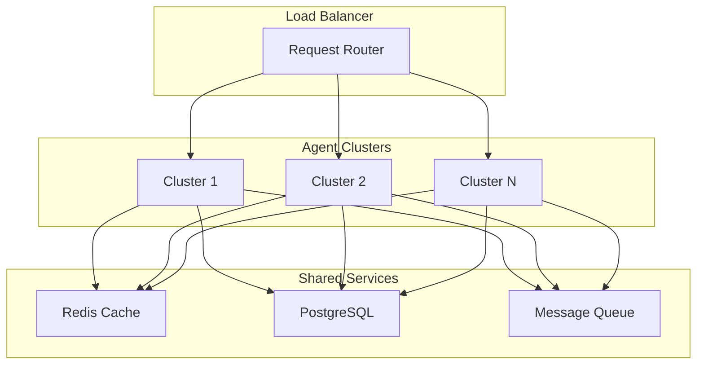
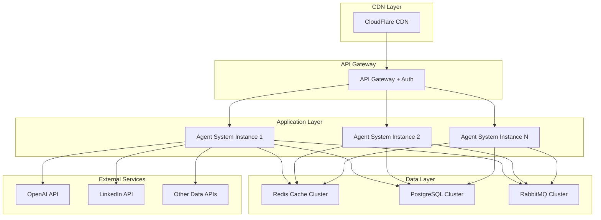

# LLM-Based Multi-Agent Reasoning System Documentation

## Table of Contents
1. [System Overview](#system-overview)
2. [Architecture](#architecture)
3. [Agent Specifications](#agent-specifications)
4. [Message Flow](#message-flow)
5. [Implementation Details](#implementation-details)
6. [Performance & Scalability](#performance--scalability)
7. [Production Deployment](#production-deployment)

## System Overview

The LLM-Based Multi-Agent Reasoning System is designed to intelligently determine job changes and Ideal Customer Profile (ICP) matching through autonomous agent collaboration. Unlike rule-based systems, this implementation leverages Large Language Models for contextual reasoning, inference, and decision-making.

### Key Features

- **Dynamic Orchestration**: No fixed workflows - agents decide what to do next based on context
- **Contextual Reasoning**: LLMs understand business nuances, company relationships, and career progression
- **Autonomous Collaboration**: Agents call each other based on intelligent decision-making
- **Explainable AI**: Every decision comes with reasoning and confidence scores
- **Fault Tolerance**: Graceful handling of incomplete, conflicting, or noisy data

### Core Capabilities

1. **Job Change Detection**
   - Understands company mergers, acquisitions, and rebranding
   - Recognizes subsidiary relationships and corporate restructuring
   - Differentiates between role changes and company transformations

2. **ICP Matching**
   - Contextual understanding of job titles and seniority levels
   - Industry-aware role interpretation
   - Career progression analysis

3. **Business Intelligence**
   - Email pattern generation and validation
   - Company domain analysis
   - Professional profile synthesis

## Architecture

### High-Level Architecture Diagram



### Agent Interaction Flow



### Data Flow Architecture

```mermaid
graph LR
    subgraph "Input Processing"
        Input[Profile Input]
        Validate[Input Validation]
        Parse[Data Parsing]
    end
    
    subgraph "Agent Processing"
        Research[Research & Enrichment]
        Analysis[Multi-Agent Analysis]
        Synthesis[Result Synthesis]
    end
    
    subgraph "Output Generation"
        Decision[Final Decision]
        Confidence[Confidence Scoring]
        Explanation[Reasoning Generation]
    end
    
    Input --> Validate
    Validate --> Parse
    Parse --> Research
    Research --> Analysis
    Analysis --> Synthesis
    Synthesis --> Decision
    Decision --> Confidence
    Confidence --> Explanation
```



## Agent Specifications

### 1. Orchestrator Agent

**Role**: Master coordinator that plans and manages the entire reasoning workflow.

**Capabilities**:
- Dynamic workflow planning based on input analysis
- Agent coordination and message routing
- Result aggregation and quality control
- Error handling and recovery

**LLM Prompt Strategy**:
```
System: You are an intelligent orchestrator agent responsible for coordinating 
multiple specialized agents to determine job changes and ICP matching...

User: Analyze this profile and determine optimal agent sequence...
```

**Decision Logic**:
- Analyzes input completeness and quality
- Determines which agents are needed
- Plans optimal execution sequence
- Monitors agent responses and adjusts plan

### 2. Research Agent

**Role**: Gathers and enriches profile data from various sources.

**Capabilities**:
- Current job and company information lookup
- Career history reconstruction
- Professional network analysis
- Data source credibility assessment

**Knowledge Sources**:
- LinkedIn profiles and company pages
- Crunchbase company data
- News articles and press releases
- Industry databases

**Output Format**:
```json
{
  "found": true,
  "current_company": "Company Name",
  "current_title": "Job Title",
  "previous_roles": [...],
  "confidence": 0.95,
  "sources": ["linkedin", "crunchbase"]
}
```

### 3. Company Analysis Agent

**Role**: Analyzes relationships between companies to determine job change validity.

**Capabilities**:
- Merger and acquisition detection
- Rebranding and name change recognition
- Parent-subsidiary relationship analysis
- Corporate restructuring understanding

**Analysis Framework**:
- **Rebranding**: Same ownership, leadership, product → No job change
- **Acquisition**: Different ownership but role continuity → Context-dependent
- **Merger**: Combined entities → Analyze role changes
- **Spinoff**: New entity but related → Context-dependent

### 4. Profile Analysis Agent

**Role**: Analyzes career progression and professional development.

**Capabilities**:
- Career trajectory assessment (upward/lateral/downward)
- Role evolution and skill development tracking
- Seniority level determination
- Industry transition analysis

**Progression Patterns**:
- **Individual Contributor → Manager → Director → VP/C-Suite**
- **Specialist → Senior Specialist → Principal → Research Fellow**
- **Cross-functional moves and their implications**

### 5. ICP Matching Agent

**Role**: Determines fit against Ideal Customer Profile criteria.

**Capabilities**:
- Contextual title interpretation
- Seniority level assessment
- Industry vertical matching
- Role responsibility analysis

**Matching Logic**:
- Parse ICP criteria into structured requirements
- Map current role against requirements
- Consider industry variations and title inflation
- Generate confidence-weighted match scores

### 6. Decision Synthesis Agent

**Role**: Combines all agent outputs into final decisions with reasoning.

**Capabilities**:
- Multi-source evidence weighting
- Conflict resolution between agent outputs
- Confidence score calculation
- Reasoning chain generation

**Synthesis Process**:
1. Weight agent outputs by confidence levels
2. Resolve conflicting information
3. Generate evidence-based reasoning
4. Calculate overall confidence score

## Message Flow

### Message Bus Architecture

The system uses an event-driven message bus for agent communication:



### Message Types

1. **Request Messages**
   - Agent-to-agent task requests
   - Data inquiry messages
   - Analysis requests

2. **Response Messages**
   - Task completion responses
   - Data delivery messages
   - Analysis results

3. **Control Messages**
   - System status updates
   - Error notifications
   - Workflow coordination

### Message Structure

```python
@dataclass
class AgentMessage:
    sender: AgentType
    recipient: AgentType
    content: Dict[str, Any]
    message_type: str
    timestamp: datetime
    correlation_id: str
    priority: int
```

## Implementation Details

### LLM Integration

**Model Selection**:
- **Primary**: GPT-4 for complex reasoning tasks
- **Secondary**: GPT-3.5-turbo for simple classification tasks
- **Fallback**: Claude-3 for redundancy and comparison

**Prompt Engineering Strategy**:

1. **System Prompts**: Define agent role and capabilities
2. **Context Injection**: Provide relevant background information
3. **Few-shot Examples**: Include example inputs/outputs for consistency
4. **Output Formatting**: Specify structured JSON responses
5. **Confidence Calibration**: Request confidence scores with explanations

**Example Prompt Template**:
```python
system_prompt = f"""
You are a {agent_role} agent with the following capabilities:
{capabilities_list}

Your task is to {specific_task}.

Always respond in JSON format with the following structure:
{expected_output_schema}

Consider these factors in your analysis:
{analysis_factors}
"""
```

### Error Handling & Resilience

**LLM Response Handling**:
- JSON parsing with fallback strategies
- Response validation against expected schemas
- Retry logic for API failures
- Graceful degradation for partial failures

**Agent Failure Recovery**:
- Circuit breaker pattern for failing agents
- Fallback agent implementations
- Partial result acceptance with lower confidence

**Data Quality Issues**:
- Input validation and sanitization
- Missing data imputation strategies
- Conflicting information resolution
- Noise filtering and outlier detection

### Confidence Scoring

**Multi-Level Confidence**:
1. **Agent-Level**: Individual agent confidence in their analysis
2. **Evidence-Level**: Strength of supporting evidence
3. **System-Level**: Overall confidence in final decision

**Confidence Calculation**:
```python
def calculate_system_confidence(agent_results):
    weighted_sum = 0
    total_weight = 0
    
    for agent, result in agent_results.items():
        weight = AGENT_WEIGHTS[agent]
        confidence = result.get('confidence', 0.5)
        
        weighted_sum += weight * confidence
        total_weight += weight
    
    return weighted_sum / total_weight if total_weight > 0 else 0.5
```

## Performance & Scalability

### Performance Metrics

**Response Time Targets**:
- Simple profiles: < 5 seconds
- Complex profiles: < 15 seconds
- Batch processing: 100 profiles/hour

**Accuracy Targets**:
- Job change detection: > 95% accuracy
- ICP matching: > 92% accuracy
- Overall system confidence: > 90%

### Optimization Strategies

**LLM Call Optimization**:
- Response caching for similar queries
- Batch processing for multiple profiles
- Parallel agent execution where possible
- Smart prompt caching

**Resource Management**:
- Connection pooling for API calls
- Memory management for large profile batches
- Rate limiting to respect API constraints
- Load balancing across model providers

**Scalability Patterns**:



## Production Deployment

### Infrastructure Requirements

**Compute Resources**:
- CPU: 8+ cores per instance
- RAM: 16GB+ per instance
- Storage: SSD with 1TB+ capacity
- Network: High-bandwidth for API calls

**External Dependencies**:
- OpenAI/Anthropic API access
- LinkedIn API or similar data sources
- Company databases (Crunchbase, etc.)
- Email validation services

### Deployment Architecture



### Monitoring & Observability

**Key Metrics**:
- Request processing time per agent
- LLM API response times and error rates
- Agent accuracy scores over time
- System resource utilization
- Cost per processed profile

**Alerting**:
- High error rates or timeouts
- Accuracy drops below thresholds
- Resource exhaustion warnings
- External API rate limit notifications

**Logging Strategy**:
- Structured logging with correlation IDs
- Agent decision audit trails
- Performance metrics collection
- Error tracking and analysis

### Security Considerations

**Data Protection**:
- Encryption in transit and at rest
- Personal data anonymization
- GDPR compliance measures
- Access logging and audit trails

**API Security**:
- Rate limiting and DDoS protection
- API key management and rotation
- Request validation and sanitization
- Authentication and authorization

**Model Security**:
- Prompt injection prevention
- Output validation and filtering
- Model behavior monitoring
- Bias detection and mitigation

### Cost Optimization

**LLM Cost Management**:
- Intelligent caching strategies
- Model selection based on task complexity
- Batch processing for efficiency
- Response reuse and deduplication


**Infrastructure Optimization**:
- Auto-scaling based on demand
- Resource right-sizing
- Reserved instance utilization
- Multi-cloud cost comparison

**Estimated Costs** (per 1000 profiles):
- LLM API calls: $15-25
- Infrastructure: $5-10
- External APIs: $10-20
- Total: $30-55 per 1000 profiles
